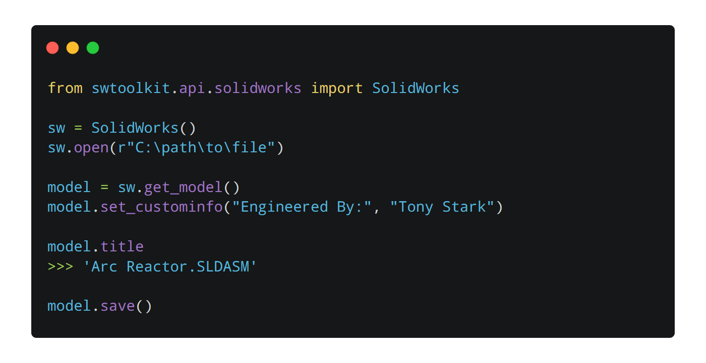

.. image:: docs/images/logo_swtoolkit.png
        :alt: SW ToolKit
        :align: center
        :width: 600

.. This '|' generates a blank line to avoid sticking the logo to the
   section.

.. image:: https://img.shields.io/pypi/v/swtoolkit.svg?style=flat-square
        :target: https://pypi.python.org/pypi/swtoolkit
        :alt: PyPi Version

SolidWorks Toolkit for Python
=============================
**SW ToolKit** allows you to leverage Python to quickly develop powerful scripts and programs to automate your SolidWorks workflow.

* Free software: MIT license

|Made With Python|

.. |Made With Python| image:: http://ForTheBadge.com/images/badges/made-with-python.svg
        :target: https://www.python.org/
        :alt: |

